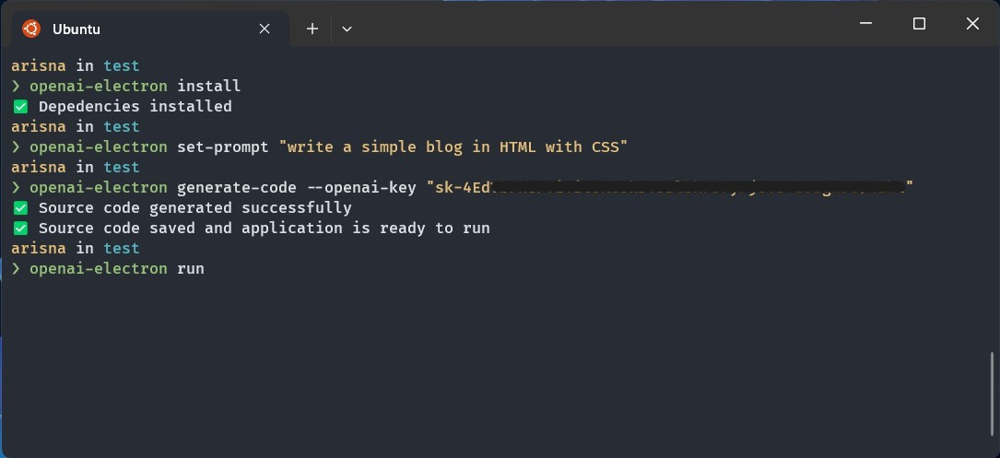
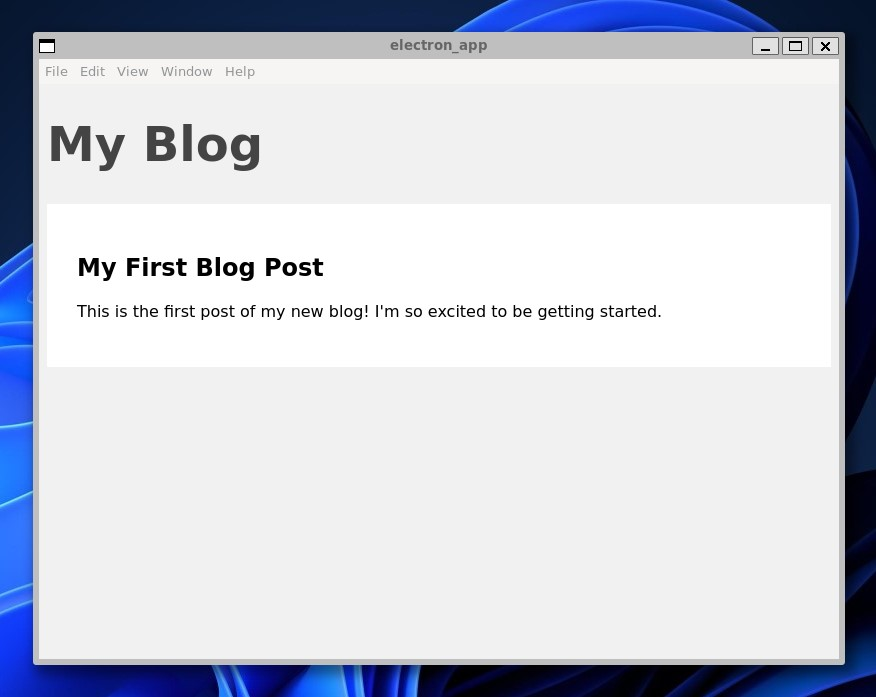

# OpenAI Electron

Command line tool to generate Electron application with OpenAI API

## Dependencies

This project need `electron-forge` to be installed globally. You can install `electron-forge` with NPM

```bash
npm install --global electron-forge
```

Make sure you already add NPM directory to your $PATH so `electron-forge` can be exexuted from anywhere

```bash
export PATH="/usr/local/share/npm/bin:/usr/local/bin:/usr/local/sbin:~/bin:$PATH"
```

## Installation

You can install this project by using NPM

```bash
npm install --global openai-electron
```

You can check if the project installed properly and the version of the project

```bash
openai-electron --version
```

You can see all the avaiable commands

```bash
openai-electron -H
```

## How To Use

First, you need to install all Electron dependencies with `install` command

```bash
openai-electron install
```

Second, you need to set the prompt for OpenAI. For example: `write a simple blog in HTML with CSS`

```bash
openai-electron set-prompt "write a simple blog in HTML with CSS"
```

After that, you need an OpenAI API key to generate source code from OpenAI. Read more: [How to create OpenAI API keys](https://elephas.app/blog/how-to-create-openai-api-keys-cl5c4f21d281431po7k8fgyol0). Use `generate-code` command to start generating source with OpenAI API

```bash
openai-electron generate-code --openai-key "sk-4EdVbFhGP..."
```

After the source code successfully generated, you can either run the source code with `run` command

```bash
openai-electron run
```

Or you can export the source code into executable program with `export` command

```bash
openai-electron export --output .
```



